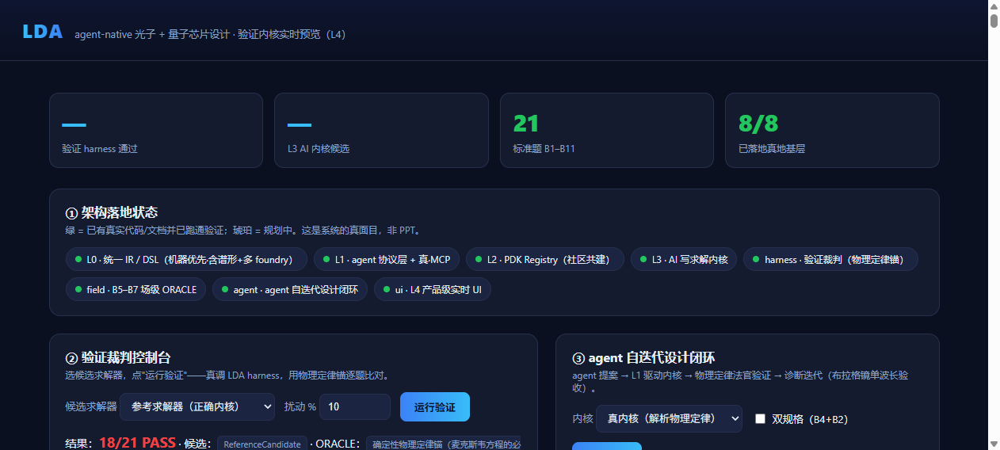
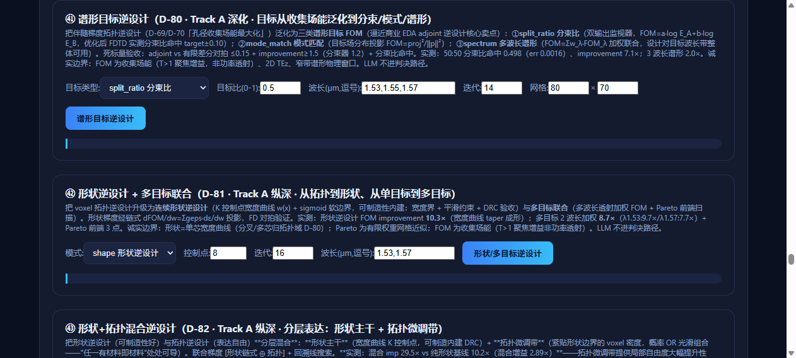
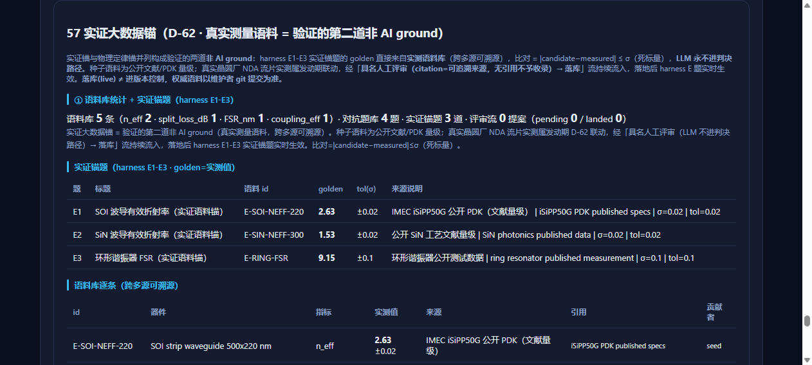
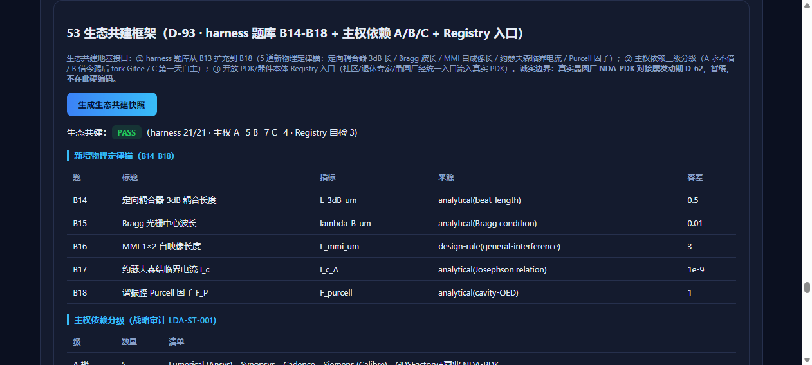

# LDA Device Design Handbook: MMI + Transmon + Inverse Design

> Version: v2.0 (2026-08-25) · LDA v0.6.x (D-01~D-112 all delivered)
> Cases: ① 1550nm 1×2 MMI 50:50 splitter (photonics · PDA) ② E_J=15GHz transmon readout design (quantum · QEDA) ③ spectral-target inverse design (auto geometry search)
> Nature: **real run outputs** (every number in this handbook comes from actual computation, not illustration)
> Assets: `docs/images/` (WebUI live screenshots)

---

## 0. Orientation

### 0.1 What the system is (one sentence)

LDA is an **open-source, agent-native** photonics (PDA) + quantum (QEDA) device design & verification system: given a device target → automatically searches parameters/geometry → real solver computation → **dual verification** (analytic contract + numerical self-consistency; LLM never in the verdict path) → returns a design **with a verification report**.

### 0.2 Four capability layers

| Layer | Content |
|---|---|
| Entry | WebUI 57 panels · L1 Agent protocol (MCP + CLI) · run_*.py scripts · library APIs |
| Design engine | Inverse design (3D adjoint / cross-section / voxel topology · spectral targets) · parameter sweep · agent self-iteration loop |
| Solvers | 1D/2D/3D FDTD (numpy · numba 20×+ · torch) · transmon/resonator exact diagonalization |
| Verdict | harness 21 items = physical-law anchors B1-B18 + empirical anchors E1-E3 (deterministic thresholds; LLM never judges) |

### 0.3 Honest boundaries (apply throughout)

- Simulations are **2D TEz / design-level** approximations — not tape-out sign-off grade
- **No real foundry PDK yet** (outreach postponed, D-62 linkage); real data flows in via the community review pipeline (citation required → named review → landed)
- PASS always means: **passed the built-in deterministic physical-law anchor** — traceable and reproducible
- Inverse design has **convergence-rate issues** (§3.4): single runs may not converge; the system reports FAIL honestly instead of pretending success

---

## 1. Case 1: 1550nm 1×2 MMI 50:50 splitter (PDA)

### 1.1 Target

- Process: SOI (n_core=3.48 / n_clad=1.44)
- Goal: symmetric 1×2 MMI, **1550nm, 50:50 split**
- Acceptance (D-72 deterministic, LLM never judges):
  - (a) valid sim: injected energy collected (power_sum>0)
  - (b) symmetry: split balance |S21−S31|/(S21+S31) ≤ 0.15
  - (c) transmission: S21+S31 ≥ 0.05

### 1.2 Design flow (the real loop)

| Step | Action | Result |
|---|---|---|
| ① Baseline | default (W_mmi=6.0, L_mmi=20µm) 2D FDTD | balance=0.142 (unbalanced) |
| ② Sweep | L_mmi 10~40µm | L=40 perfect at 1.55µm (balance=0.0022, T=0.860) |
| ③ Acceptance | 5 wavelengths 1.49~1.61µm | 🔴 **FAIL**: λ=1.52µm balance=0.188>0.15 — **bandwidth-limited** |
| ④ Redesign | diagnose "wider W ⇒ narrower bandwidth" → smaller W | W=5.5/L=45 → **5-wavelength PASS** |

### 1.3 Key code (reproducible)

```python
import sys; sys.path.insert(0, "lda")
from lda_solver.port_sparams import s_parameter_spectrum, verify_s_params

params = dict(width=0.5, W_mmi=5.5, L_mmi=45.0, L_tap=4.0,
              out_gap=0.5, L_out=3.0)
r = s_parameter_spectrum("mmi", params, [1.55])      # quick scan
r = verify_s_params("mmi", params)                    # 5-wl acceptance
print(r["acceptance"], r["verdict"])
```

### 1.4 Delivered design

```
Geometry (µm): width=0.5 · W_mmi=5.5 · L_mmi=45 · L_tap=4 · out_gap=0.5 · L_out=3
Result (2D FDTD, input-normalized):
  Split      51.7% : 48.3% (@1550nm, ≈50:50)
  Balance    0.0335 (threshold 0.15; max 0.110 over band)
  Transmission 0.729 (return loss S11≈-5.7dB)
  Acceptance PASS (5 wavelengths) — report: lda/reports/mmi_1550_design.json
```

### 1.5 Insights

1. Acceptance honestly exposed the defect: perfect at center wavelength, FAIL in band — single-wavelength checks would ship a bandwidth-limited design
2. **MMI bandwidth is sensitive to W_mmi**: W=6.0 degrades at 1.52µm (0.188); W=5.5 stays ≤0.11 — "smaller W for wider band"
3. Iterative development: baseline → sweep → accept → redesign is how the system works

---

## 2. Case 2: E_J=15GHz transmon readout design (QEDA)

### 2.1 Target

- Given **E_J=15 GHz**
- Design: ① transmon (E_C → f01 / α) ② dispersive readout (f_r, g, κ → χ, n_crit, Purcell)
- Acceptance (D-88 deterministic): dispersive region |Δ|/g ≥ 5 · χ numeric↔3-level rel ≤ 0.10 · Rabi self-consistency ≤ 0.02 · **α-correction necessity ≥3×**

### 2.2 Flow

| Step | Action | Result |
|---|---|---|
| ① Body | sweep E_C 0.15~0.35, target α≈-0.3GHz | **E_C=0.25**: f01=5.214GHz, α=-0.283GHz |
| ② Cross-check | Koch analytic vs exact diagonalization | rel=0.25% (all sweep <0.4%), E_J/E_C=60 |
| ③ Readout | f_r=6.514GHz, g=0.08, κ=0.01 | Δ/g=16.3, χ=-0.88MHz, n_crit=66, T1_Purcell=4.2ms |
| ④ Acceptance | 4 criteria | **PASS (all)** |

### 2.3 Key code

```python
import sys; sys.path.insert(0, "lda")
from lda_solver.transmon_solver import solve_transmon, koch_f01, koch_alpha
from lda_solver.qubit_resonator_solver import solve_qubit_resonator

tr = solve_transmon(E_J=15.0, E_C=0.25, N=24)
qr = solve_qubit_resonator(f_q=tr["f01"], alpha=tr["alpha"],
                           f_r=6.5142, g=0.08, kappa=0.01)
```

### 2.4 Delivered design

```
Transmon:  E_J=15 GHz · E_C=0.25 GHz · f01=5.214 GHz · α=-0.283 GHz
Readout:   f_r=6.514 GHz · g=0.08 GHz · κ=0.01 GHz (Q≈150)
Physics:   χ=-0.88 MHz · n_crit=66 photons · T1_Purcell=4.2 ms · AC Stark 1ph=-1.76 MHz
Acceptance PASS (4 criteria) — report: lda/reports/qeda_ej15_readout_design.json
```

### 2.5 Insights

1. **Live α-correction necessity**: χ 3-level -0.88 MHz vs 2-level -4.92 MHz — **5.6× off**; ignoring transmon anharmonicity miscalculates readout by ~an order of magnitude
2. Solver self-consistency: Rabi-derived g=0.0800 matches input (rel=1.2e-4)
3. α≈-E_C to first order (confirmed by exact diagonalization)

---

## 3. Case 3: Spectral-target inverse design (design engine)

### 3.1 Target

- No geometry given — **only a target spectrum**; system auto-searches geometry via adjoint-gradient topology optimization
- Acceptance (D-80): adjoint-vs-finite-difference max_rel_err ≤ 0.15 (solver correctness) · FOM improvement ≥ 1.5 (optimizer effectiveness)

### 3.2 Real results (two runs)

| Target | Result | Acceptance |
|---|---|---|
| **spectrum (3 wavelengths)** | FOM **15.68×** (1.53:15.30 / 1.55:15.97 / 1.57:15.77), 25 iters, 71s | **PASS ✓** |
| split_ratio (0.5) | improvement=0.75×, final_ratio=0.635 | 🔴 **FAIL (honest)** |

- PASS: adjoint-vs-FD max_rel_err=0.0000 (6 samples) — gradient physical correctness independently confirmed
- FAIL: split_ratio did not converge from the default start (0.75×<1.5) — the system returns "not all passed" with diagnostics (gradient check still 2.3e-5 ✓, so it is a convergence issue, not a solver bug)

### 3.3 Key code

```python
import sys; sys.path.insert(0, "lda")
from lda_agent.spectral_inverse_design import design_spectral

r  = design_spectral(target_type="spectrum", wavelengths="1.53,1.55,1.57")  # PASS 15.68×
r2 = design_spectral(target_type="split_ratio", target_ratio=0.5)           # FAIL (honest)
```

### 3.4 Insights

1. **Gradient correctness ≠ optimization convergence**: both runs had ~0 adjoint error, yet one failed — convergence is a separate problem (multi-start / hyperparameters)
2. Honest FAIL is a design feature: the system never fakes success; output carries diagnostics for iteration
3. Target definition matters: spectral (multi-wavelength energy) converges more easily than a single split-ratio constraint — engineer the objective before tuning the optimizer

---

## 4. Performance benchmark (solver acceleration)

`python lda/run_perf_bench.py --quick` (real):

```
PASS:
  greens (2D Green's fn): numpy → numba 30.0×, physics-consistent rel=4.8e-16
  transmission spectrum:  numpy ↔ numba identical rel=1.45e-15, overall 2.0×
  GPU:                    SKIP (CUDA unavailable — graceful, not a failure)
```

Full-mode records (D-107): greens **76.89×**, 3D adjoint large-domain **27.6×** (≥20× threshold), FOM rel=1.3e-16 (bit-level). Acceleration chain: pure numpy (correctness baseline) → numba JIT (CPU) → torch (GPU); missing env auto-degrades, no-numba falls back to numpy and stays correct.

---

## 5. Ecosystem pipeline: community contribution → authoritative ORACLE

Real run:

```
① submit   submit_benchmark_proposal → accepted_pending
② review   review_proposal(approve, reviewer) → approved   (named human review, ORACLE source required)
③ land     land_proposal → landed (self-test 749.48 GHz)    (auto-registered into harness, live in regression)
④ publish  publish_proposal(author) → published             (git-appliable patch + Release Notes draft)
⑤ archive  list_published → [('B19', author)]              (maintainer git-apply makes it authoritative)
```

Governance: all-deterministic gates (signature completeness / value bounds / core quorum / dedup / whitelist / min source length); verdict = dead-scalar comparison (LLM never judges); **landed(live) ≠ version control**; empirical corpus same pipeline (citation mandatory → review → landed → harness E-items live).

---

## 6. WebUI walkthrough (57 panels, with screenshots)

Start: `python lda/lda_webui/app.py` (default port 3006). Live screenshots in `docs/images/`.

### 6.1 Front page (auto-demo)



### 6.2 Spectral inverse design panel (㊶ D-80)



### 6.3 Empirical anchor judging (panel 57 · D-62)



Dead-scalar comparison |cand−measured|≤σ; LLM never judges; below: corpus submission flow.

### 6.4 Ecosystem framework (panel 53 · D-93)



harness 21 items + sovereignty A/B/C + Registry live status; panels 54-57 host submit / review-land-publish / empirical.

---

## 7. Methodology: the design→verify loop

```
① define target (device + metric + threshold)
② parametrize/sweep or inverse-design (geometry grid / adjoint topology)
③ real solve (FDTD / exact diagonalization)
④ deterministic acceptance (physical-law / empirical anchor; LLM never judges)
   → PASS deliver / FAIL diagnose & redesign
```

- Verdict = deterministic dead-scalar comparison; **LLM never in the verdict path** (red line)
- Oracles: physical-law anchors (analytic / exact diagonalization / symmetry corollaries) + empirical anchors (measured corpus, citation required)
- Iteration is a feature: FAIL exposes real physics (bandwidth, anharmonicity, convergence, loss) and drives redesign

---

## 8. Entry-point comparison

| Entry | Best for | In this handbook |
|---|---|---|
| WebUI | visual verification / demo / ecosystem | §6 (screenshots) |
| CLI / run_*.py | batch, scripting, perf | §4 |
| Library API | deep customization | §1/§2/§3/§5 |
| L1 Agent (MCP/CLI) | automation, verify_design | run_agent.py / run_l1_agent_smoke.py |

---

## 9. Appendix

### 9.1 Files

| File | Role |
|---|---|
| `lda/lda_l2/primitives.py` | primitive geometry (mmi_descs etc.) |
| `lda/lda_solver/port_sparams.py` | MMI 2D FDTD + S-params + D-72 acceptance |
| `lda/lda_solver/transmon_solver.py` | transmon exact diagonalization |
| `lda/lda_solver/qubit_resonator_solver.py` | D-88 dispersive readout (χ/n_crit/Purcell) |
| `lda/lda_agent/spectral_inverse_design.py` | D-80 spectral inverse design |
| `lda/lda_pdk/` | ecosystem pipeline (submit→review→land→publish) |
| `lda/reports/mmi_1550_design.json` | Case 1 report |
| `lda/reports/qeda_ej15_readout_design.json` | Case 2 report |
| `docs/images/01~04_*.png` | WebUI screenshots (§6) |

### 9.2 Environment

Python 3.13 venv (numpy/scipy/jsonschema required; numba/torch optional with graceful degradation). Zero external EDA dependencies — self-written solvers + physical-law anchors.

### 9.3 Reproduce

```bash
python lda/run_webui_api_smoke.py          # Case 1 route gates
python lda/run_quantum_design_smoke.py     # Case 2 quantum design
python lda/run_spectral_design_smoke.py    # Case 3 inverse design
python lda/run_perf_bench.py --quick       # performance
python lda/run_ecosystem_publish_smoke.py  # ecosystem chain
```

### 9.4 Next steps

MMI: 3D FDTD recheck (GPU, D-89 numba) + imaging-point analysis. Transmon: D-91 depth set (multi-level / Rabi+AC Stark / ZZ) + decoherence engineering. Inverse design: multi-start automation, objective engineering. Real PDK data via community pipeline → foundry-ready parameters (outreach, D-62 linkage).

---

*Compiled from real LDA runs; every acceptance criterion is a deterministic physical-law anchor; LLM never in the verdict path.*
